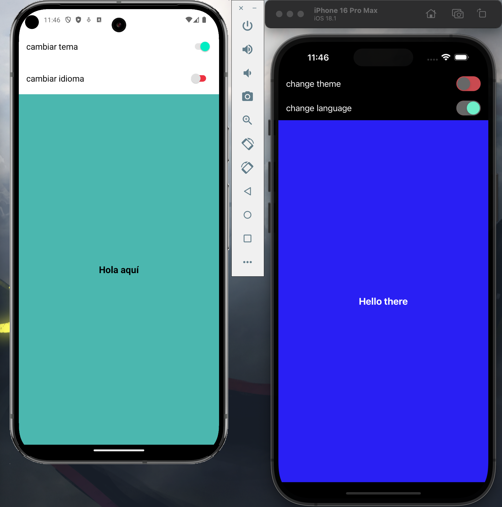

# Solid. Software Random color Test

App for an equity investor who wants to monitor a set of stocks that are on his radar.

### Run

**Environment**

Remember that for the correct functioning of the project it is necessary to have android studio, xcode configured or have a physical phone and the latest expo update to at least run the app on a device.

**Install dependencies**

```
npm install
```

**Init project**
```
npx expo start
```
**Run IOS**

once the expo terminal has been started, press the “i” key or execute the following command in another terminal:

```
npx ios
```

**Run Android**
once the expo terminal has been started, press the “a” key or execute the following command in another terminal:

```
npx android
```

### 🛠 Tech and Libraries

- [React-Native](https://reactnative.dev/): Library to make native ios/android code
- [expo](https://expo.dev/): Framework to make native ios/android code
- [TypeScript](https://www.typescriptlang.org/): Application typing stronger
- [Context API](https://react.dev/learn/scaling-up-with-reducer-and-context): Simpler and more native data storage than Redux or Redux Toolkit, ideal for handling global states without external libraries

### App Screenshots

|                                 |                                     Mobile                                  |
| :------------------------------:| :--------------------------------------------------------------------------:|
|               Screen 1          |                                               |


# Command tree for the files

```
├── App.tsx
├── README.md
├── app.json
├── assets
│   ├── adaptive-icon.png
│   ├── favicon.png
│   ├── icon.png
│   ├── screen1.png
│   └── splash-icon.png
├── index.ts
├── package-lock.json
├── package.json
├── src
│   ├── components
│   │   ├── app
│   │   │   ├── SettingsState.tsx
│   │   │   └── index.ts
│   │   ├── index.ts
│   │   └── ui
│   │       ├── SafeWrapper.tsx
│   │       ├── SwitchSetting.tsx
│   │       └── index.ts
│   ├── context
│   │   └── config
│   │       ├── ConfigContext.tsx
│   │       ├── ConfigProvider.tsx
│   │       └── ConfigReducer.ts
│   ├── hooks
│   │   ├── index.ts
│   │   └── useRandomColor.ts
│   ├── index.ts
│   ├── screens
│   │   ├── HomeScreen.tsx
│   │   └── index.ts
│   ├── types
│   │   ├── index.ts
│   │   └── theme.ts
│   └── utils
│       ├── const
│       │   ├── enums.ts
│       │   └── index.ts
│       ├── getTranslation.ts
│       ├── i18n
│       │   ├── en.json
│       │   └── es.json
│       ├── index.ts
│       ├── isIOS.ts
│       └── theme
│           ├── index.ts
│           └── theme.ts
└── tsconfig.json
```